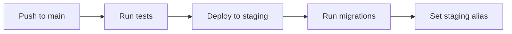
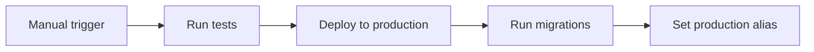

# 🚀 CI/CD Pipeline

## 📋 Workflow Overview

### Автоматические деплои:

- **Push to `main`** → 🎭 **Auto-deploy to Staging**

### Ручные деплои:

- **Manual trigger** → 🚀 **Deploy to Production**
- **Manual trigger** → 🎭 **Deploy to Staging**

## 🔧 Setup GitHub Secrets

Добавьте следующие secrets в GitHub repository settings:

### Required Secrets:

```bash
VERCEL_TOKEN                    # Vercel CLI token
VERCEL_ORG_ID                  # Vercel organization ID
VERCEL_PROJECT_ID_STAGING      # Staging project ID
VERCEL_PROJECT_ID_PRODUCTION   # Production project ID
DATABASE_URL_STAGING           # Staging database connection
DATABASE_URL_PRODUCTION        # Production database connection
```

### 🔑 How to get secrets:

#### 1. Vercel Token:

```bash
vercel login
vercel whoami
# Go to: https://vercel.com/account/tokens
```

#### 2. Organization ID:

```bash
vercel teams ls
```

#### 3. Project IDs:

```bash
# For staging project
vercel ls --scope=your-team

# For production project
vercel ls --scope=your-team
```

## 🌊 Deployment Flow

### 1. 🔍 **Pull Request Validation** (On PR)

- ✅ ESLint checks
- ✅ Unit tests (Jest)
- ✅ TypeScript validation
- ✅ Build verification
- 🛡️ Blocks merge if tests fail

### 2. 🧪 **Tests & Linting** (On main push)

- ✅ ESLint checks
- ✅ Unit tests (Jest)
- ✅ TypeScript validation
- ✅ Build verification

### 3. 🎭 **Staging Deployment** (Auto on main push)



### 4. 🚀 **Production Deployment** (Manual)



## 🎯 How to Deploy

### Automatic Staging:

1. Push code to `main` branch
2. GitHub Actions automatically deploys to staging
3. Check staging environment
4. If OK → proceed to production

### Manual Production:

1. Go to GitHub Actions tab
2. Select "CI/CD Pipeline"
3. Click "Run workflow"
4. Choose "production"
5. Click "Run workflow"

### Manual Staging:

1. Go to GitHub Actions tab
2. Select "CI/CD Pipeline"
3. Click "Run workflow"
4. Choose "staging" (default)
5. Click "Run workflow"

## 🛡️ Safety Features

### Environment Protection:

- **Staging**: No restrictions
- **Production**: Requires manual approval

### Database Safety:

- Migrations run before deployment
- Connection validation
- Rollback on failure

### Build Validation:

- Linting must pass
- TypeScript compilation
- Test suite (when implemented)

## 🔍 Monitoring

### GitHub Actions Dashboard:

- Real-time deployment status
- Build logs and errors
- Deployment history

### Vercel Dashboard:

- Live deployment monitoring
- Performance metrics
- Error tracking

## 📊 Environments

| Environment    | URL                          | Auto Deploy       | Manual Deploy |
| -------------- | ---------------------------- | ----------------- | ------------- |
| **Staging**    | `gymfuel-staging.vercel.app` | ✅ (on main push) | ✅            |
| **Production** | `gymfuel.vercel.app`         | ❌                | ✅            |

## 🚧 Future Enhancements

### Phase 1: Testing

- [ ] Unit tests with Jest
- [ ] Integration tests
- [ ] E2E tests with Playwright

### Phase 2: Advanced Features

- [ ] Slack notifications
- [ ] Rollback automation
- [ ] Blue-green deployments
- [ ] Performance monitoring

### Phase 3: Security

- [ ] Security scanning
- [ ] Dependency vulnerability checks
- [ ] Code quality gates

## 🐛 Troubleshooting

### Common Issues:

#### Failed deployment:

1. Check GitHub Actions logs
2. Verify environment variables
3. Check database connectivity

#### Migration errors:

1. Verify DATABASE_URL
2. Check migration files
3. Manual database inspection

#### Build failures:

1. Run locally: `npm run build`
2. Fix TypeScript errors
3. Update dependencies

## 📞 Support

For deployment issues:

1. Check GitHub Actions logs
2. Review Vercel deployment logs
3. Verify environment variables
4. Test locally first
